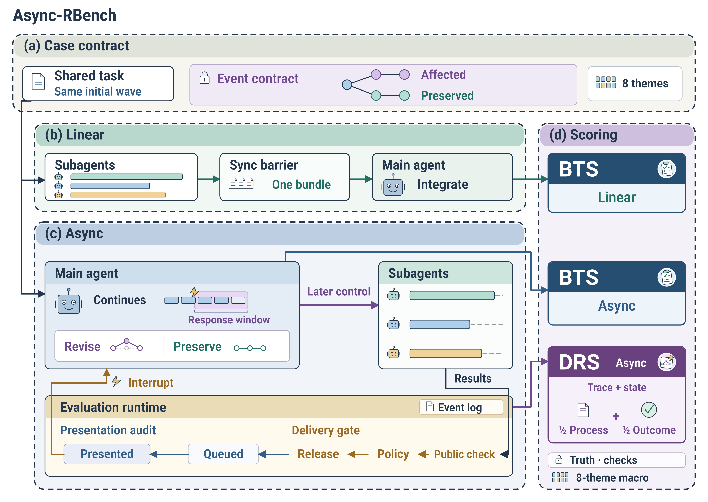

<div align="center">

# Async-RBench

### BENCHMARKING CORRECT REPLANNING UNDER ASYNCHRONOUS SUBAGENT INTERRUPTIONS

[](evaluation_contract.json)
[](PROTOCOL.md)
[](pyproject.toml)
[](LICENSE)
[](https://pope8zdt.github.io/Async-RBench/)

[Website](https://pope8zdt.github.io/Async-RBench/) · [Leaderboard](https://pope8zdt.github.io/Async-RBench/leaderboard/) · [Evaluate](https://pope8zdt.github.io/Async-RBench/evaluate/) · [Tutorial](https://pope8zdt.github.io/Async-RBench/docs/) · [中文运行说明](docs/CASE_RUNBOOK.zh-CN.md)

</div>

Async-RBench measures whether an agent can integrate independently completing subagent results and revise its plan when evidence arrives late, out of order, partially, repeatedly, in conflict, or under failure and resource pressure.

<p align="center">
  
</p>

<p align="center">
  <a href="docs/assets/async-rbench-framework-v11.png">PNG</a> ·
  <a href="docs/assets/async-rbench-framework-v11.svg">SVG</a> ·
  <a href="docs/assets/async-rbench-framework-v11.pdf">PDF</a>
</p>

## News

- **2026-09:** Track B completed a real two-case Codex CLI + Luna validation in isolated Linux containers.
- **2026-09:** The public website, DRS/BTS leaderboard, local evaluation workflow, and reviewed submission path are live.
- **v11.0.0:** The Track A evaluation contract is frozen for reproducible comparison.

## At a glance

| Item | Description |
| --- | --- |
| Task suite | 201 high-quality tasks across eight asynchronous event themes |
| Comparison | The same registered task runs in paired **Linear** and **Async** modes |
| Track A | Fixed reference harness for official leaderboard evaluation |
| Track B | Claude Code, Codex CLI, LangGraph, OpenAI Agents SDK, or custom harness components |
| Primary metric | **DRS**, ranked from high to low |
| Paired task metric | **Async BTS − Linear BTS**, ranked from high to low |
| Execution | Participant-owned machine; Docker isolates task, child, verifier, and agent runtimes |

The evaluation kernel owns scheduling, event delivery, private truth, workspace isolation, verification, scoring, and aggregation. The evaluated adapter owns the main agent and child agents. A fixed child-model pool is not an experiment condition.

## Reproduce the benchmark

### Environment

The standard API evaluation path does not require a local GPU, CUDA, cuDNN, PyTorch, model weights, or checkpoints.

| Component | Requirement |
| --- | --- |
| Host | Windows 10/11 x86-64 with hardware virtualization |
| Runtime | Python 3.11+, PowerShell 7, Git |
| Isolation | Docker Desktop using the Linux container engine |
| Storage | At least 30 GB free for images and run artifacts |
| Model | An API or Track B framework compatible with the selected configuration |

The latest container validation used an Intel Core i7-12700K, 32 GB RAM, Windows 11 x64, Python 3.12.13, PowerShell 7.6.5, Docker Desktop 4.73.1, and Docker Engine 29.4.3. Its local GPU was not used. See the [validation report](docs/reports/2026-09-07-track-b-linux-containers.md) for the container resource limits and immutable runtime IDs.

### Install

```powershell
git clone https://github.com/pope8zdt/Async-RBench.git
Set-Location Async-RBench

py -3.11 -m venv .venv
.\.venv\Scripts\Activate.ps1
python -m pip install --upgrade pip
python -m pip install -e ".[test]"
docker info
```

Dependencies and optional Track B integrations are declared in [`pyproject.toml`](pyproject.toml). Framework-specific container versions are pinned under [`docker/track-b/`](docker/track-b/).

### Validate without calling a model

```powershell
python -m async_rbench.cli validate --release
python -m async_rbench.main_experiment check --root .
python -m pytest -q
```

A clean checkout may skip author-local tests whose large upstream source trees are intentionally excluded from Git. It should not report failed or errored tests.

### Run one paired task

Create a local model configuration with the [configuration generator](https://pope8zdt.github.io/Async-RBench/evaluate/) or copy [`configs/model-profiles/reference-config.example.yaml`](configs/model-profiles/reference-config.example.yaml) outside version control. Store only the credential variable name in the file.

```powershell
$env:MODEL_API_KEY = Read-Host "API key" -MaskInput

.\run_case.ps1 `
  -Instance "secure-release::seed-1" `
  -Config "model-config.yaml" `
  -Repetitions 1 `
  -Seed 2026
```

This calibration case is the minimal end-to-end example. It creates an immutable manifest, runs both modes, scores the episodes, aggregates the pair, and writes a run audit under `artifacts/experiments/`.

### Reproduce the main experiment

```powershell
.\run_main.ps1 `
  -Config "model-config.yaml" `
  -Repetitions 3 `
  -Seed 2026
```

The [main experiment manifest](experiments/formal-47/README.md) freezes task membership, eight-theme distribution, three paired repetitions, seed `2026`, and contract digests. Historical calibration/development/test labels remain provenance metadata and do not select the current leaderboard cohort. Results are averaged within each task, then within each theme, then equally across themes. A seed fixes benchmark-controlled choices; remote model responses may still vary.

Retain the repository commit, exact model ID, reasoning settings, configuration digest, manifest, `results.json`, and `run-audit.json` with every result. Resume only from the original experiment directory and manifest.

## Tasks and data

Registered tasks are listed in [`cases/registry.json`](cases/registry.json). Each case separates participant-visible instructions and artifacts from evaluator-only event truth, validators, and hidden checks. [`event_taxonomy.json`](event_taxonomy.json) defines the eight public themes, while [`evaluation_contract.json`](evaluation_contract.json) freezes scoring and eligibility.

Standard registered bundles under `cases/` are self-contained for containerized evaluation. Cases derived from external datasets record source identifiers and hashes in `public_case.yaml` and may include a case-level provenance record such as [`PROVENANCE.md`](cases/gaia2-stockholm-moveout/PROVENANCE.md). Large upstream repositories, VM assets, and source caches are excluded from Git and remain subject to their original licenses and access terms; [`upstream/README.md`](upstream/README.md) lists the supported acquisition paths.

Private evaluator material stays outside participant workspaces and public submissions. The calibration command above provides a complete runnable path without downloading optional upstream corpora.

## Training and checkpoints

Async-RBench evaluates existing models and agent systems; it does not train a model. There is no optimizer, loss function, training split, or benchmark checkpoint to reproduce. Model weights are supplied by the selected API provider or agent framework, and the exact model/configuration identity is recorded with the run.

## Track B: agent systems

Track B runs complete agent frameworks through the same benchmark-owned public protocol. Build one maintained Linux runtime and verify it before launching paid episodes:

```powershell
python -m pip install -e .
python docker/track-b/build.py codex
Copy-Item configs/track-b/codex-cli.example.yaml track-b-config.yaml
python -m async_rbench.track_b doctor --config track-b-config.yaml
python -m async_rbench.track_b conformance --config track-b-config.yaml --output artifacts/track-b/conformance --cases secure-release
```

Maintained integrations include Claude Code, Codex CLI, LangGraph, and OpenAI Agents SDK. Custom packages may implement `ModelBackend`, `ContextBuilder`, `DelegationPolicy`, `AgentPolicy`, and `LifecycleHooks`. The evaluator still owns execution modes, event schedules, isolated task containers, private verification, scoring, and aggregation.

Read the [Track B guide](docs/track-b.md) for authentication, paired runs, custom component loading, result packaging, and the two-case live validation.

## Results and metrics

The [public leaderboard](https://pope8zdt.github.io/Async-RBench/leaderboard/) opens with DRS, the primary dynamic-replanning metric. The BTS view shows both paired task scores and ranks by **Async BTS − Linear BTS**. Higher values rank higher in both views.

| Output | Meaning |
| --- | --- |
| DRS | Dynamic replanning quality under asynchronous events |
| Linear BTS | Base-task correctness in Linear mode |
| Async BTS | Base-task correctness in Async mode |
| BTS difference | Async BTS minus Linear BTS |

Scores use a 0–100 scale. Complete reviewed results receive formal ranks; incomplete coverage remains provisional. Coverage, execution status, materials review, and independent reproduction are recorded separately.

Published evidence:

- [Track A leaderboard](https://pope8zdt.github.io/Async-RBench/leaderboard/)
- [Track B Codex CLI + Luna live validation](docs/reports/2026-09-07-track-b-linux-containers.md)
- [Frozen evaluation protocol](PROTOCOL.md)
- [Result and termination contract](docs/async-rbench-result-contract-and-termination.md)

## Submit results

Runs stay on the participant's machine. The packaging command exports only allowlisted aggregate fields and excludes credentials, provider configuration, raw case scores, traces, and local paths.

```powershell
$benchmarkCommit = git rev-parse HEAD
python -m async_rbench.submissions package `
  --root . `
  --manifest artifacts/experiments/MY_RUN/manifest.json `
  --benchmark-commit $benchmarkCommit

python -m async_rbench.submissions check --root .
```

Read the [submission and review guide](submissions/README.md), then open the [Track A result form](https://github.com/pope8zdt/Async-RBench/issues/new?template=benchmark-result.yml). Track B uses `track_b package` and the separate [Track B result form](https://github.com/pope8zdt/Async-RBench/issues/new?template=track-b-result.yml).

## Repository map

```text
Async-RBench/
├── async_rbench/          # Kernel, runtime, scoring, aggregation, Track B API
├── adapters/              # Executable adapter entry points
├── cases/                 # Registered public/private task bundles
├── configs/               # Model profiles and runtime configuration
├── experiments/           # Frozen experiment definitions
├── schemas/               # Machine-readable contracts
├── submissions/           # Aggregate packages and review records
├── website/               # Static public website
├── docs/                  # Protocols, runbooks, and validation reports
├── run_case.ps1           # One-task paired launcher
└── run_main.ps1           # Main experiment launcher
```

Generated runs belong under `artifacts/experiments/` and remain outside version control.

## Documentation

- [Chinese operator runbook](docs/CASE_RUNBOOK.zh-CN.md)
- [Evaluation protocol](PROTOCOL.md)
- [Adapter protocol](ADAPTER_PROTOCOL.md)
- [Kernel contract](docs/kernel-contract.md)
- [Evaluation tracks](docs/evaluation-tracks.md)
- [Track B agent systems](docs/track-b.md)
- [Submission and review guide](submissions/README.md)

## License

Async-RBench source code and original documentation are released under the [Apache License 2.0](LICENSE). Third-party datasets, tasks, repositories, VM assets, and model/framework dependencies retain their own licenses and access terms; review the relevant case provenance before redistribution.

## Citation

If you use Async-RBench in research, cite the repository and the exact release evaluated:

```bibtex
@software{async_rbench_2026,
  title   = {Async-RBench: Benchmarking Asynchronous Result Integration and Dynamic Replanning},
  author  = {Async-RBench Contributors},
  year    = {2026},
  version = {11.0.0},
  url     = {https://github.com/pope8zdt/Async-RBench}
}
```

## Maintainer and contact

Maintained by [@pope8zdt](https://github.com/pope8zdt). Use [GitHub Issues](https://github.com/pope8zdt/Async-RBench/issues) for questions, bug reports, reproducibility reports, and result-submission support.
