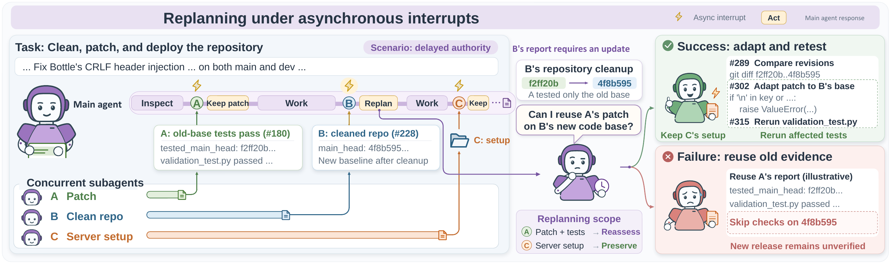
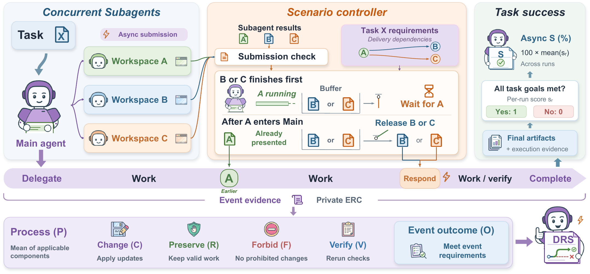
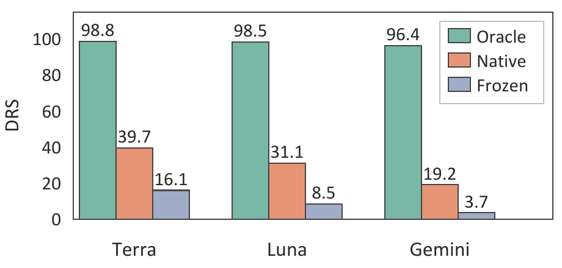
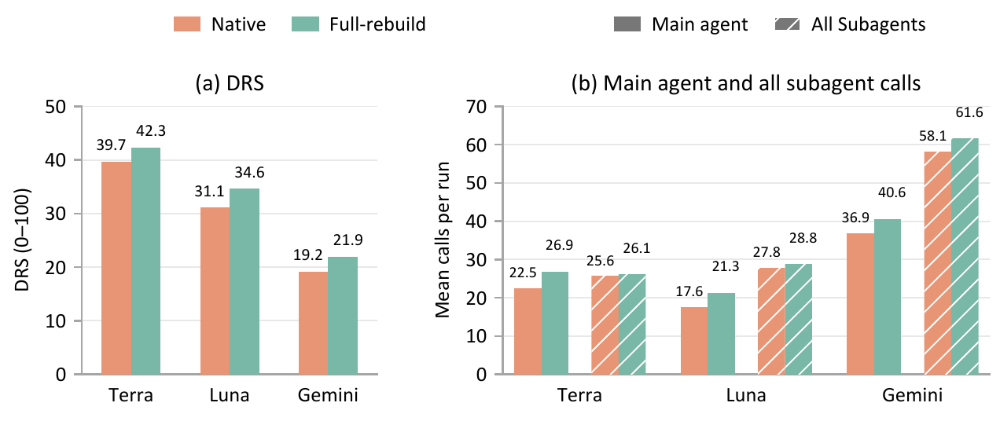

<div align="center">

# Async-RBench

**Benchmarking Asynchronous Task Execution in LLM Agents**

[](https://github.com/pope8zdt/Async-RBench/actions/workflows/ci.yml)
[](LICENSE)
[](pyproject.toml)
[](data/async-rbench/registry.json)
[](CITATION.cff)

[Overview](#overview) · [Results](#main-results) · [Dataset](#dataset) · [Quick start](#quick-start) · [Evaluation](#evaluation) · [Documentation](#documentation)

</div>



## Overview

Async-RBench tests whether a main agent can use results returned by concurrently
running subagents. A strong agent must revise work invalidated by new evidence,
preserve work that remains valid, avoid prohibited changes, and rerun the checks
affected by the update.

We compare two delivery modes. **Batched** runs the subagents concurrently but
holds their results until every required workflow terminates. **Async** presents
eligible results as they arrive while the main agent continues working. The task,
subagent workflows, limits, and scoring rules are otherwise held fixed.

Version: 11.0.0  
Contract: frozen  
Release: `v11.0-paper`



## Main results

- Across nine evaluated agents, Async DRS ranges from **19.2 to 45.1**. Oracle
  responses score **96.4–98.8** on the same events.
- Mean task success falls from **29.7% under Batched delivery to 26.0% under
  Async delivery**. All nine agents have a lower Async point estimate.
- Full-rebuild raises DRS from 39.7 to 42.3 for Terra, 31.1 to 34.6 for Luna,
  and 19.2 to 21.9 for Gemini, while increasing mean model calls by 7.5–10.2%.

<p align="center">
  
  
</p>

The paper evaluates Claude Sonnet 5, GPT-5.6 Terra, Qwen3.7 Plus, GLM5.3
Flash, GPT-5.6 Luna, DeepSeek V4 Pro, Qwen3.5 27B, Kimi K2.5, and Gemini 3
Flash High. The main agent and its subagents use the same model in each run.

## Dataset

The release contains **200 case directories / 200 registered instances**. Cases
are balanced across five source families and eight asynchronous scenarios.

| Property | Paper setting |
|---|---:|
| Source families | 40 each from GAIA2, MultiAgentBench, OSWorld, SWE-bench, and Terminal-Bench |
| Async scenarios | 8 scenarios, 25 tasks each |
| Initial subtasks | 621 total: 73 with two, 40 with three, and 87 with four or more |
| Difficulty | 104 medium / 96 hard |
| Splits | 81 calibration / 30 development / 89 test |
| Repetitions | 3 per task and delivery mode |
| Main experiment | 10,800 episodes |

Each case contains `public/`, `task/`, and `PROVENANCE.md`. The public package
does not include solutions, hidden tests, event schedules, verifier logic,
credentials, or experiment traces. Formal scoring uses a separately distributed
judge bundle.

## Quick start

Python 3.11 or newer is required.

```bash
python -m venv .venv
python -m pip install -U pip
python -m pip install -e ".[test]"

async-rbench list
async-rbench validate-public
python -m pytest -q
```

A valid checkout reports:

```json
{"valid": true, "case_count": 200, "instances": 200}
```

## Evaluation

Create and run a manifest after obtaining the matching judge bundle:

```bash
async-rbench validate-judge --judge-root <judge-root>
async-rbench certify-release --judge-root <judge-root>

async-rbench-eval make-manifest \
  --output manifest.json \
  --repetitions 3 \
  --guidance incentive \
  --seed 2026 \
  --execution-modes linear async \
  --judge-root <judge-root>

async-rbench-eval run-manifest \
  --manifest manifest.json \
  --output <run-directory> \
  --judge-root <judge-root>
```

The paper reports Batched task success, Async task success, and Async Dynamic
Replanning Score (DRS). For an event, the process score `P` averages the
applicable Change, Preserve, Forbid, and Verify components. With event outcome
`O`, `DRS_event = 100 × (P + O) / 2`.

Machine-readable outputs retain the field names `linear_base_task_score`,
`async_base_task_score`, and `async_dynamic_replanning_score`. They store values
on `[0, 1]`; paper tables display percentages.

## Documentation

| Document | Contents |
|---|---|
| [Evaluation protocol](docs/protocol.md) | Delivery modes, limits, information boundary, and scoring |
| [Adapter protocol](docs/adapter-protocol.md) | JSONL interface and delivery lifecycle |
| [CLI reference](docs/cli.md) | Validation, manifests, execution, and aggregation |
| [Dataset guide](docs/dataset.md) | Public case layout and provenance |
| [Kernel contract](docs/kernel-contract.md) | Kernel-owned scheduling and verification |
| [Adapter contract](docs/adapter-contract.md) | Participant-facing runtime boundary |
| [Configuration](configs/README.md) | Model profiles and native runtimes |
| [Contributing](docs/contributing.md) | Development and pull requests |
| [Security](docs/security.md) | Reporting sensitive issues |

## Repository structure

```text
Async-RBench/
├── assets/                   # figures used on this page
├── adapters/                 # adapter entry points
├── configs/                  # contracts, profiles, and runtime locks
├── data/async-rbench/        # 200 public task bundles and registry
├── docs/                     # protocol and usage documentation
├── paper_artifacts/          # paper experiment manifest
├── schemas/                  # adapter event schemas
├── scripts/                  # release and runtime helpers
├── src/async_rbench/         # evaluation framework
├── tests/                    # public verification suite
└── upstream/                 # upstream source records
```

## Citation and license

Citation metadata is available in [`CITATION.cff`](CITATION.cff). Author names
remain anonymized during double-blind review.

Async-RBench code and documentation are released under Apache-2.0. Transformed
task materials retain their upstream terms; see [`NOTICE`](NOTICE) and
[`THIRD_PARTY_LICENSES.md`](THIRD_PARTY_LICENSES.md).
